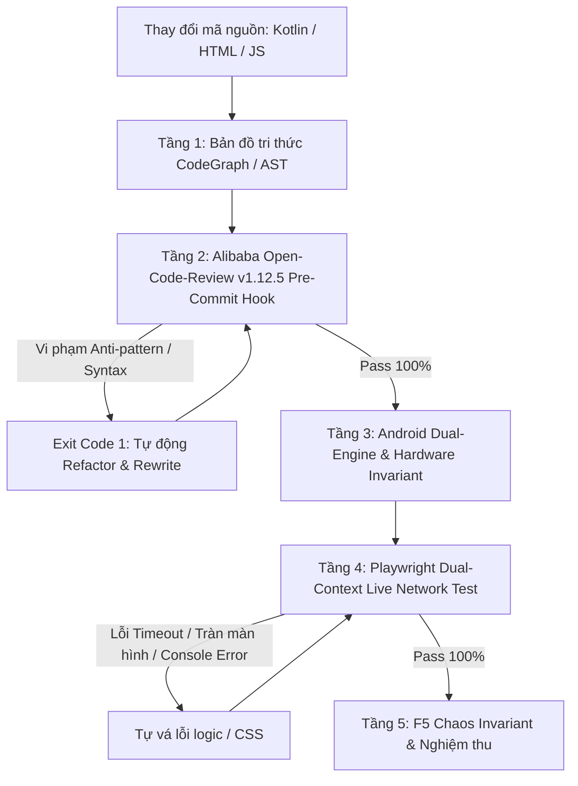

# QUY TRÌNH KIỂM THỬ VÀ DIỆT BUG CHUẨN CÔNG NGHIỆP (ZERO-BUG MULTI-AGENT PIPELINE)
**Dự án**: CVA-SmartGuardian (KHKT 2026-2027)  
**Địa chỉ lưu trữ**: `C:\Users\HPZBook\Desktop\APP KHKT`  
**Phiên bản chuẩn**: 2.0.0 (Áp dụng bắt buộc)

---

## 1. NGUYÊN TẮC BẤT BIẾN (ZERO-GUESSWORK)
1. **Tuyệt đối không "vừa đá bóng vừa thổi còi"**: Mọi thay đổi mã nguồn (Web Portal, Android Native, Firebase, API) phải đi qua hệ thống kiểm duyệt độc lập trước khi commit hoặc bàn giao.
2. **Đo đạc mạng thật (Real Network Trace)**: Trong các hệ thống thời gian thực (Firebase Realtime, Web Telemetry, Heartbeat), kiểm thử phải đo gói tin mạng thật, không giả lập trong RAM cục bộ.
3. **Vòng lặp tự vá lỗi (Self-Healing Loop)**: Khi phát hiện lỗi hoặc vi phạm, AI Agent phải tự đọc log lỗi, phân tích tọa độ/dòng mã sai và viết lại code cho đến khi đạt PASS 100%.

---

## 2. KIẾN TRÚC 5 TẦNG KIỂM SOÁT ĐỘC LẬP

### Tầng 1: Bản đồ tri thức mã nguồn (CodeGraph)
- Kiểm tra toàn vẹn cấu trúc file, quan hệ phụ thuộc giữa các component:
  - `android-app/`: `GuardianAccessibilityService`, `BootReceiver`, `ScreenStateReceiver`, `AppDatabase`.
  - `index.html`: `updateChildDashboardLive()`, `switchCategoryTab()`, `renderWebBrowsingBreakdown()`.
- Tránh việc sửa đổi ở module này gây side-effect ngoài ý muốn ở module khác.

### Tầng 2: Alibaba Open-Code-Review (OCR) Pre-Commit Gatekeeper
- Tích hợp trực tiếp vào Git Hook toàn cầu (`.git/hooks/pre-commit`).
- Tiêu chuẩn kiểm duyệt gắt gao:
  - Cấm `var`, cấm so sánh lỏng `==`, cấm `innerHTML` không khử độc XSS.
  - Cấm nuốt lỗi rỗng `catch (e) {}`.
  - Cấm dữ liệu mock / fake heartbeat trong code production.
  - Chặn đứng 100% các commit lỗi bằng `Exit Code 1`.

### Tầng 3: Nhận diện Dual-Engine & Bất biến phần cứng (Android Client)
- **AccessibilityService (Event-Driven)**: Lắng nghe `TYPE_WINDOW_STATE_CHANGED` để bắt chính xác 100% app đang hiển thị trên màn hình (Foreground Package).
- **Screen-State Receiver (Hardware Invariant)**: Bắt sự kiện `ACTION_SCREEN_OFF` để lập tức đóng phiên đếm giờ và tắt cờ Online khi học sinh tắt màn hình điện thoại.
- **Deep-Link 1 Chạm**: Cung cấp lối tắt trực tiếp mở cài đặt trợ năng OEM (Xiaomi HyperOS, MIUI, Oppo, Vivo, Samsung) kèm hộp thoại hướng dẫn từng bước.

### Tầng 4: Kiểm thử mạng độc lập Playwright (Dual-Context)
- Mở song song 2 Browser Contexts độc lập hoàn toàn (Context Phụ huynh và Context Học sinh).
- Cắt bỏ `BroadcastChannel` để ép các bên phải giao tiếp qua mạng thật (Firebase / Server).
- Đo đạc độ trễ phản hồi (Latency $\le 500\text{ms}$).
- Kiểm tra Console F12: Đảm bảo 0 lỗi Uncaught Error, 0 cảnh báo bảo mật.

### Tầng 5: Thử thách F5 Chaos Invariant & UI Layout Gatekeeper
- Thử nghiệm tải lại trang đột ngột (F5 reload) khi đang ở giữa các trạng thái (đang xem tab Duyệt Web, đang mở modal).
- Đảm bảo trạng thái người dùng chọn (`window.userHasChosenTab`, `window.currentCategoryTab`) không bị polling đè mất.
- Quét đa độ phân giải ($1920 \times 1080$ và $1366 \times 768$ và mobile $390 \times 844$), đảm bảo `scrollWidth === clientWidth` (0 bẫy tràn ngang).
